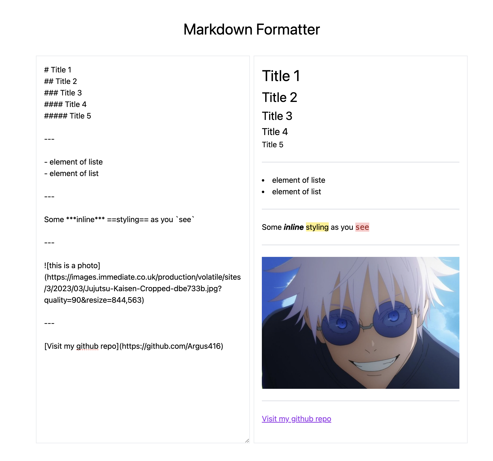

# Markdown Parser

## Live Preview

[Live preview](https://markdown-parser-jet.vercel.app/)

## Features

- **Real-Time Preview:** See your changes instantly as you type.
- **Synchronized Scrolling:** Keep your editing and preview panes in sync.
- **User-Friendly Interface:** Intuitive design for a seamless editing experience.
- **Local Storage Saving:** Your work is automatically saved in local storage to prevent data loss.
- **Extended Markdown Support:**
  - Headings (H1 - H6)
  - Bold and Italic Text
  - Strikethrough
  - Blockquotes
  - Inline Code
  - Horizontal Rules
  - Highlighted Text
  - Links and Images
  - Unordered (Bullet) Lists

## Project Preview



## Technologies

- React
- Tailwind

## Getting Started

To run the project, ensure you have npm version 18 or higher installed. Then, execute the following commands:

```bash
npm install
npm run dev
```
